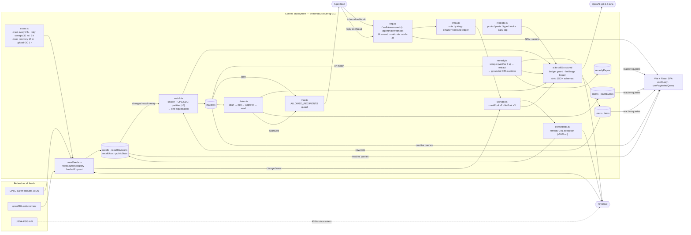

# Hackathon log

- **Project:** Recall Desk
- **Event:** Convex All Gas Hackathon
- **What it does:** Watches the federal recall feeds (CPSC, FDA, USDA-FSIS) against the retailer receipts you forward by email, alerts you the day something you own is recalled, and files the claim with the manufacturer for you.
- **Live app:** https://tremendous-bullfrog-311.convex.site
- **Repo:** https://github.com/mrtblount/recall-desk
- **Frontend:** Convex static hosting
- **Convex deployment:** https://tremendous-bullfrog-311.convex.cloud
- **Components:** @convex-dev/static-hosting, @firecrawl/firecrawl-convex, @agentmail/convex, @convex-dev/workpool (crawlPool, llmPool)
- **Convex features:** schema, tables, indexes, full-text search index, queries, mutations, actions, internal functions, paginated queries, realtime queries, HTTP actions, crons, scheduled functions (workpool), file storage, system tables, components, tests (convex-test)
- **Auth:** Convex Auth
- **AI models:** gpt-5.6-luna (receipt extraction incl. vision, match adjudication, remedy extraction, claim drafting; terra staged for escalation)
- **Started:** 2026-08-30T06:30:40Z
- **Last updated:** 2026-09-22T05:40:00Z

## What this is

Recall Desk is a single-purpose everyday app: **forward your receipts once, and never miss a recall on something you own.** Two lanes share one corpus. The public lane crawls the CPSC, FDA and USDA-FSIS recall feeds on Convex crons (NHTSA is scaffolded in the schema and UI labels but not crawled; it was the M11 buffer item and stayed below the line), tracks changes, and renders a live board anyone can open with no account — today's recalls, an "expanded" badge when a recall grows, a stats ticker. The personal lane gives each user a dedicated AgentMail ingest address; forwarded retailer receipts are parsed by OpenAI into inventory items, a matcher watches that inventory against the corpus, and a match triggers an alert, a Firecrawl scrape of the manufacturer's remedy page, extraction of the actual claim procedure, a prefilled claim draft, and — on approval — a real outbound claim email whose replies thread back onto the claim timeline. All state, scheduling and reactivity live in Convex; there is no other server or database.

- **Demo video:** not recorded yet (placeholder until the final week)
- **Stack:** Convex (database, queries, actions, crons, workpool, static hosting) · Firecrawl (recall feeds + remedy portals) · AgentMail (receipts in, claims out, replies back) · OpenAI (receipt extraction, remedy-procedure extraction, match adjudication, claim drafting) · Vite + React + TypeScript
- **Built by:** Tony Blount, solo, with Claude Code as the coding agent. Every line in this repo was written for this hackathon, starting 2026-08-30.

## How to run

```bash
git clone https://github.com/mrtblount/recall-desk && cd recall-desk
npm install
npx convex dev          # provisions/attaches a dev deployment, writes .env.local
npm run dev             # Vite dev server against that deployment
npm run deploy          # build + push backend + upload static files to <deployment>.convex.site
```

Secrets live in `.env.local` (gitignored) and in Convex environment variables (`npx convex env set`). `.env.example` lists the variable names.

## Why the sponsor stack is load-bearing

- **Firecrawl.** No crawl, no corpus and no remedy procedures. Two measurements taken while planning (2026-08-30) drove the design: (a) the Louisville Ladder remedy portal at atticstairwayrecall.expertinquiry.com returns only "You need to enable JavaScript to run this app" to plain HTTP but renders fully under Firecrawl, including the registration form's required fields; (b) the Casely recall page measures 108,913 characters raw vs 22,388 with `onlyMainContent`, a 5x strip of storefront chrome with zero loss of claim-critical fields (model E33A, JotForm claim link, photo instructions, gift card option, the recall contact inbox).
- **AgentMail.** Email is the product's interface. Ingestion is inbound mail. Claims are outbound mail. Manufacturer replies are inbound mail that advances state. Remove it and nothing enters or leaves.
- **OpenAI.** Four generation jobs: receipt-to-items extraction, remedy-page-to-procedure extraction, match adjudication, claim drafting. Remove it and nothing parses.

## Architecture

One Convex deployment holds every table, every scheduled job, the HTTP surface (auth discovery, webhooks, the static site) and the reactive queries the SPA subscribes to. Firecrawl, AgentMail and OpenAI are called from actions; nothing else runs anywhere.



**The four Convex ideas the design leans on.**

1. **Transactions carry the side effects.** Every hash write that marks a recall as changed enqueues its Firecrawl detail scrape in the same mutation; every match insert schedules its remedy scrape and alert in the same transaction; every `llmUsage` row updates the budget singleton in the same mutation. Nothing can be half-done.
2. **Idempotency is a table, not a hope.** `[source, sourceId]` for recalls, `messageId` for inbound mail, `[itemId, recallId]` for matches, `threadId` for replies, `contentHash` guards on every extraction save. Any cron can be killed and re-run.
3. **Stranded states recover by cron, never by hand.** Budget-halted extractions, unsent alerts, sweep-capped recalls, claims stuck in `approved`, and orphaned photo uploads each have a sweep that re-drives them.
4. **The board never counts.** `publicStats` is maintained in the writing mutation; `lastSeenAt` is touched at most every 12 hours so a 1,600-row crawl does not re-push every open subscription.

**Module map**

| Area | Files | What lives there |
|---|---|---|
| Corpus crawl | `convex/crawl/feeds.ts`, `cpsc.ts`, `fda.ts`, `fsis.ts`, `detail.ts`, `extract.ts`, `mappers` | registry-driven feed runs, source mappers, idempotent upsert, revision archiving, Firecrawl detail scrapes, remedy-URL extraction |
| Corpus queries | `convex/recalls.ts` | `recentRecalls` (paginated), `searchRecalls` (full-text), `stats`, UPC/NDC lookup sync |
| Auth + identity | `convex/auth.ts`, `users.ts`, `tags.ts` | Convex Auth v1 email OTP via AgentMail, immutable per-user ingest tag |
| Intake | `convex/email.ts`, `receipts.ts`, `emailParse.ts`, `imageSniff.ts`, `intakeCap.ts`, `src/lib/imagePrep.ts` | webhook routing, raw persistence, photo/paste/typed intake, HEIC→JPEG in the browser, per-user daily cap |
| LLM wrapper | `convex/ai.ts` | one `callStructured` for all four jobs: budget guard, retry policy, token ledger, list-price cost table |
| Matching | `convex/match.ts`, `matchScore.ts`, `gtin.ts`, `ndc.ts`, `recallCodes.ts` | prefilter scoring, UPC check digits, NDC normalization, code mining from recall text, adjudication, alert, sweeps |
| Remedy | `convex/remedy.ts`, `remedySanitize.ts`, `src/lib/prefill.ts` | portal scrape, procedure extraction, grounded link sanitizer, bot-wall detection, receipt-driven prefill |
| Claims | `convex/claims.ts`, `mail.ts` | drafting, edit lock, atomic send slot, allowlist guard, delivery + reply timeline, recovery cron |
| Surface | `convex/http.ts`, `crons.ts`, `pools.ts`, `convex.config.ts`, `src/App.tsx` | routes, schedules, workpools, component registration, the SPA |

12,817 lines across `src/` and `convex/` (generated code excluded), 15 test files, 84 tests, all written since 2026-08-30.

## Firecrawl proofs, measured

Three places where the corpus or the claim flow does not exist without Firecrawl, each measured against the plain-HTTP alternative.

| Proof | Plain HTTP | Through Firecrawl | Where it runs |
|---|---|---|---|
| **Louisville Ladder attic-stairway portal** (atticstairwayrecall.expertinquiry.com), reproduced 2026-09-09 through the production `remedy.ts` code path | **57 characters**: "You need to enable JavaScript to run this app" | **2,501 characters** of rendered form, from which the extractor structured **4 steps and 8 required fields** | remedy scrape on match, `waitFor: 3000` |
| **Casely Power Pod E33A recall page**, measured 2026-08-30 | **108,913 characters** of storefront chrome plus notice | **22,388 characters** with `onlyMainContent` (a 4.9× strip) with zero loss of the claim-critical fields: model E33A, the JotForm claim link, photo instructions, the gift-card option, the recall contact inbox | remedy scrape, default `onlyMainContent` |
| **USDA-FSIS recall API**, discovered 2026-09-07 | **HTTP 403** from the Convex deployment, even with a browser User-Agent (bot wall on datacenter clients) | **1,235 records parsed on the first run**; the FSIS lane fetches the government API *through* Firecrawl every 6 hours | `crawl/fsis.ts`, registry cadence 360 min |

Operational notes that came out of running it, not reading about it: the free tier allows two concurrent browsers and returned 429 at 26 requests/min, so `crawlPool` paces at 2; `maxAge` defaults to two days and cached hits still bill, so every change-triggered re-scrape sets `maxAge: 0` while one-off enrichment keeps the cache; Cloudflare challenge pages are detected and never saved, because one would otherwise mark a portal unreadable forever.

## LLM cost table

All OpenAI calls go through `ai.ts callStructured`: strict JSON schema, one retry on a malformed *completed* response, one retry with doubled output budget on truncation, then flagged for human review. The guard halts at **$5/day and $70 total** (code), under the hackathon's $75 hard ceiling, and every call books `inputTokens`, `outputTokens` and `costUsd` in the same mutation that updates the budget singleton.

Ledger as of 2026-09-22 (dev deployment, where every receipt, match and claim in this log ran; the production ledger is empty, see the next section):

| Purpose | Model | Calls | Input tokens | Output tokens | Booked cost | Per call |
|---|---|---|---|---|---|---|
| Receipt extraction (email, paste, typed) | gpt-5.6-luna | 4 | 1,592 | 611 | $0.0005 | $0.00013 |
| Receipt photo (vision, `detail: "original"`) | gpt-5.6-luna | 6 | 47,076 | 2,405 | $0.0074 | $0.0012 |
| Match adjudication | gpt-5.6-luna | 12 | 3,951 | 1,758 | $0.0019 | $0.00016 |
| Remedy-procedure extraction | gpt-5.6-luna | 7 | 13,423 | 3,714 | $0.0043 | $0.0006 |
| Claim drafting | gpt-5.6-luna | 1 | 381 | 400 | $0.0003 | $0.0003 |
| **Total** | | **30** | **66,423** | **8,888** | **$0.0144** | |

Pricing in the ledger is list price, re-verified 2026-09-14 at developers.openai.com/api/docs/pricing: luna $0.20 in / $1.20 out per 1M tokens, terra $2.00 / $12.00 (staged for escalation, never yet invoked). Rows booked before 2026-09-14 (about $0.005 of the total) were priced at a stale half-price table, so true spend to date is closer to **$0.019**. A full loop for one item, from a photographed receipt through adjudication, remedy extraction and a drafted claim, costs about **$0.002 to $0.003**; the $70 guard covers roughly 25,000 of them. Vision dominates: one 1536×2048 receipt photo is ~3.7k input tokens at original detail, deliberately chosen because the vision guide recommends it for OCR and the extractor reads model numbers and NDCs off the image.

## Production state as of 2026-09-22

Read from the production deployment at 05:20 UTC, about seven hours before the submission deadline.

**Corpus (Lane A), live and self-updating.**

| Source | Active | Expanded | Closed | Total |
|---|---|---|---|---|
| CPSC | 217 | 2 | 0 | 219 |
| FDA | 124 | 0 | 52 | 176 |
| USDA-FSIS | 179 | 1 | 1,056 | 1,236 |
| **All** | **520** | **3** | **1,108** | **1,631** |

140 revision rows archive superseded versions of changed recalls. 164 recalls have been detail-scraped through Firecrawl and 85 carry an extracted manufacturer remedy URL. 159 UPC/NDC lookup keys cover the recalls that print codes. The crawl cron last ran CPSC at 04:22 UTC today and FDA/FSIS at 00:22 UTC, on cadence; the newest recall in the corpus was published 2026-09-17, which is the agencies' own publication lag, not ours.

**Personal lane (Lane B) on production: configured, deployed, never exercised.** Every key is set on production (OpenAI, Firecrawl, AgentMail, the outbound allowlist), the same code is deployed, and two accounts exist. But the production tables hold 0 items, 0 matches, 0 claims and 0 LLM calls; the two inbound emails production has ever received (2026-09-09) were correctly logged as unroutable because they carried no user tag, and created nothing. Every measurement in this log's M6 through M9b entries (receipt to items in 25 s, item to match in 5 s, claim to threaded reply in 37 s, HEIC and pharmacy receipts) was taken on the dev deployment (21 items, 5 matches, 3 remedy pages, 1 claim with 7 timeline events there). The M10 gate as written in the plan, the full loop on the production URL, is therefore still open and is the first thing to do before recording.

**Guards, verified in place:** outbound allowlist restricted to owner-controlled addresses on both deployments; `OTP_DEV_FALLBACK` set only on dev; detail scrapes capped at 300 per run; Firecrawl parallelism 2, LLM parallelism 3; per-user intake cap of 20 receipts/day; budget guard at $5/day and $70 total; no `.env` file tracked, secrets only in Convex env.


## Log

### 2026-08-30 - 8e52a04
Session 0 (milestone M1): repo, scaffold, Convex project, and a live URL. Shipped a public repo with MIT license and a hello-world shell that subscribes to a real Convex query (`convex/health.ts`, `src/App.tsx`), so the deploy proves the reactive stack end to end rather than just a static upload. Provisioned the Convex project non-interactively (`npx convex dev --once --configure new --team … --project recall-desk --dev-deployment cloud`), registered `@convex-dev/static-hosting` 0.2.1, and deployed to production on the first try. Convex features: queries, realtime queries (`useQuery`), HTTP actions (`convex/http.ts`), registered component (`convex/convex.config.ts`).

Decisions: (1) switched static hosting from the setup command's default component-owned mode (`httpPrefix: "/api"`) to app-owned root routing — `registerStaticRoutes` is the last call in `convex/http.ts` — because Convex validates JWTs by fetching `/.well-known/openid-configuration` at the deployment root, and Convex Auth serves that route from the app's router; prefixing it under `/api` would have broken auth in a later session and moved the AgentMail webhook URL. (2) Removed a `Date.now()` read from the health query after reading Convex's generated guidelines (queries are cached and never re-run because time passes). (3) Ran `npx convex ai-files install`, which added Convex's agent guidelines and skills to the repo; the hackathon build-log skill lives in `.claude/skills`.

Measured: production bundle 261.6 kB JS (79.9 kB gzip) + 1.4 kB CSS; `npx convex dev --once` pushes in ~1.3–1.5 s; static upload is 4 files; `/`, an SPA-fallback path, and hashed assets all return 200 on both the dev and prod `.convex.site` hosts, assets with `cache-control: public, max-age=31536000`. Broke: (1) `npm run deploy` as written by the setup command failed in this non-interactive shell — the wrapper runs `convex deploy` without `-y`, and the CLI refuses to prompt ("Cannot prompt for input in non-interactive terminals") whenever `CONVEX_DEPLOYMENT` points at a dev deployment. Fixed by splitting the script into the two documented halves, `npx convex deploy -y && npx @convex-dev/static-hosting upload --build --prod`, plus a `deploy:dev` script for hosted smoke tests. (2) A probe of `/favicon.svg` on the prod host *before* the first publish returned a 404 that the component stamps with `cache-control: public, max-age=14400`, so the edge cached the miss for four hours; the same path with a query string served 200 immediately. Lesson for demo week: never request a prod path before it is published, and version unhashed `public/` assets (`/favicon.svg?v=1`). Minor: npm 11 blocked esbuild's optional postinstall script (build unaffected); the global `convex` binary was stale (1.32) so the project pins `convex@1.45` locally.

Docs verification: before trusting any API note in the planning brief, a 13-agent research pass re-read the live docs for the hackathon rules, Convex CLI, static hosting, Convex Auth v1, the Firecrawl and AgentMail components, workpool/crons, and OpenAI structured outputs, with an adversarial second pass on the four decision-critical topics (227 claims confirmed, 2 refuted, 5 unverifiable). The consolidated note is `docs/api-verification-2026-08-30.md`. Headline corrections to the plan: the AgentMail free plan allows three inboxes total, so receipts will route through one shared inbox by sender address instead of one inbox per user; Firecrawl's `maxAge` defaults to two days and cached hits still cost credits, so change detection must set `maxAge: 0` or use `changeTracking`; CPSC exposes a JSON recall API alongside the HTML pages.

Next: M2 — schema for the recall corpus, one manual CPSC crawl seeding `recalls`, and the public board rendering from a live query.

### 2026-09-06 - e16a6a8
Session M2: the public board is real. Shipped the corpus schema (`convex/schema.ts`: feedSources, recalls with idempotency/board/search indexes, recallRevisions, remedyPages, publicStats, llmUsage), a CPSC seed pipeline (`convex/crawl/cpsc.ts` fetches the SaferProducts JSON API — response shape verified live first — maps defensively with unknown-narrowing and UTC-pinned dates, sha-256 contentHash, batches of 40), an idempotent upsert (`convex/recalls.ts`: insert / touch / archive-then-replace keyed on [source, sourceId], ticker counters maintained in the same mutation), public paginated `recentRecalls` + `stats` queries, and the live board UI (stats ticker, recall cards with real product photos, load-more, dark scheme). Production seeded with **193 real CPSC recalls**; a convex-test suite (4 tests: idempotent re-crawl, change-archives-revision, optional-field clearing, pagination order) runs green in ~0.3 s. Lane B tables (users/items/matches/claims) land with auth since they need `Id<"users">`.

Before deploying, a 33-agent adversarial review (3 find lenses → 2 skeptics per finding) confirmed 9 findings and refuted 6. The catch of the day: the content-change branch used `ctx.db.patch`, and Convex strips `undefined` args — so an optional field the source removed (a withdrawn product photo, a changed contact) could never be cleared while the stored contentHash claimed sync, permanently and silently. Fixed with archive-then-`ctx.db.replace`, plus: revision rows now archive the superseded version's full snapshot (diff source data for the change-tracking showcase), the crawl window now uses `LastPublishDateStart` after a live probe showed 15 of 46 recently republished records carry RecallDates outside a `RecallDateStart` window (one from 1998 — updates to old recalls would never re-enter), a "units units" label bug on real corpus strings, a freezing "updated N min ago" ticker (30 s tick), and a meta description that overclaimed unshipped features. The wider window alone grew the corpus 165 → 193.

Next: M3 — the Firecrawl component, the CPSC cron on `feedSources`, and recall-detail scrapes.

### 2026-09-06 - effc709
Session M3: the corpus updates itself. Registered the Firecrawl component (webhook route mounted at `/firecrawl/` — verified it coexists with the static site's GET catch-all) and a `crawlPool` workpool capped at 2 parallel scrapes to match Firecrawl's free-tier concurrency. A single cron ("crawl recall feeds", every 2 h) drives a data-driven `feedSources` registry, so FDA/FSIS in the next session are a registry row plus a handler, not new crons. Each feed run fetches the CPSC listing window, upserts idempotently, and — inside the same mutation transaction as the hash writes — enqueues a fresh (`maxAge: 0`) Firecrawl detail scrape for every changed recall. The detail scrape extracts the manufacturer's remedy-portal URL, which the JSON listing does not carry and the claim flow later depends on; extraction is a pure, unit-tested module (10 tests) that requires positive remedy evidence and returns null honestly. Verified on production: the deploy-time cron tick self-seeded the registry and ran the feed with no manual action (registry row created and `lastCrawledAt` stamped 19 ms apart), which is this milestone's done-means.

Live data QA caught the first extraction heuristic red-handed: on pre-2010 press-release pages (pulled in by the publish-date window) it returned CPSC page chrome — first AddToAny share links whose URLs embed the recall title, then the Threads profile. The fix was structural, not a longer blocklist: a minimum-evidence score, plus scrapes that always report so a null CLEARS a previously stored bogus or withdrawn link. Re-verified: three modern recalls extract their real portals (a recallrtr.com claim page, a dedicated skiphoprecall.com site, a retailer recall list); ten old press releases correctly cleared to none. A 22-agent adversarial review then confirmed four more defects before deploy: an unseeded registry that would have made every prod cron tick a silent no-op, change-triggered re-scrapes served from Firecrawl's 2-day cache (the exact rows flagged as changed), non-atomic hash-write/enqueue, and a non-converging backfill — all fixed, with `detailScrapedAt` now marking scraped rows. Measured: cron pipeline on dev ran fetched=35 → inserted=11 → 11 scrapes → 10 remedy URLs; free-tier rate limit observed at 429 with 26 req/min consumed, which is why the pool paces at 2.

Next: M4 — FDA + FSIS feeds in the registry, hash-diff revisions surfaced, and the "expanded" badge.

### 2026-09-07 - aa5e9cc
Session M4 + a design milestone, in one evening.

**The design.** Tony generated a landing design with ChatGPT against the live repo and it was good — so it was ported, not pasted: the prototype's static three-recall array became the live corpus behind `usePaginatedQuery` plus a new full-text `searchRecalls` query on the title search index; its embedded OFL fonts became real hashed Vite assets; its recall-detail dialog now surfaces the Firecrawl-extracted manufacturer remedy link; its sample desk/claim dialogs run on a real active recall and keep their "sample preview / no claim was sent" labels. Hosting stays on the Convex static-hosting component (`convex.site`) — the rules score `chatgpt.site` identically and it would have traded live reactivity for a static page. Design provenance noted here on purpose: ChatGPT drew it, this repo wired it to Convex.

**The feeds.** FDA and USDA-FSIS joined the corpus: **1,538 recalls across three agencies on production** (CPSC 193, FDA 110, FSIS 1,235), all pulled by the deploy-time cron tick with no manual action — the registry design from M3 meant two new rows and two handlers, zero new crons. FDA (openFDA food + drug enforcement) needed dual windows because records carry no per-record update timestamp: `report_date` catches new records, `termination_date` catches closures; degenerate `"N/A"`/empty recall numbers (which exist in live data and would collide as one upsert key) are skipped. FSIS needed the best Firecrawl story so far: its API bot-walls datacenter clients (403 from the deployment even with a browser header set), so the handler falls through to **fetching the government API through Firecrawl** — verified live, 1,235 records parsed on the first run. Expansions arrive from FSIS as new `-EXP` records and flip the "expanded" badge honestly (the one live expanded row is a real `pha-051617-exp` alert, caught case-insensitively after trimming a trailing space the live data actually contains).

**The reviews.** A 22-agent adversarial pass confirmed 8 findings before the prod deploy, including: closed recalls could never reopen (mappers now assert the active state they know, and an explicit active override reopens a row); the every-run `lastSeenAt` patch at 1,500-row scale would have re-pushed every open board subscription (now touched at most every 12 h); and the detail dialog presented terminated recalls as live safety guidance (closed rows now open with "This recall is closed." and reference framing; FSIS public health alerts are labeled as alerts; FDA rows show their recall number as a lookup path). Revision rows are now written only when content actually changed, so the status-migration run produced zero junk revisions. 20 tests green.

Next: M5 — auth and the user shell, with the shared AgentMail receipts inbox (free plan allows three inboxes total, so sender-address routing replaces per-user inboxes).

### 2026-09-08 - 755e0e0
Session M5: accounts are real. Convex Auth v1 (beta) with a custom 8-digit email-OTP provider — 15-minute expiry set explicitly, codes delivered through AgentMail's REST API once the key is connected, and a dev-only fallback (gated behind an env flag set exclusively on the dev deployment) that logs codes so the whole flow runs before the mailer exists. The Session-0 routing decision paid off on schedule: `auth.addHttpRoutes` registers `/.well-known/openid-configuration` and `/.well-known/jwks.json` at the deployment root, verified live on production — under the static-hosting setup default (`httpPrefix: "/api"`) token validation would have failed here. Each new user is stamped with an immutable 6-character tag (deterministic, collision-checked against an index) that becomes their dedicated ingest alias (`receipts+tag@…`) on the shared AgentMail inbox — dedicated address per user, one inbox bill. "My desk" is now a real surface: email → code sign-in in the dialog, signed-in desk showing the reserved forwarding alias (honestly labeled as awaiting the inbox), sign out. Auth v1 came in far under its half-day timebox; the Clerk fallback stayed on the shelf.

An 18-agent security review confirmed 7 findings pre-deploy, the sharpest two: the unconfigured-mailer fallback failed open — a production visitor would have been told "we sent a code" while the code sat in dashboard-only logs (now: prod throws and the UI says plainly that email delivery is still being connected, which is exactly what the live site shows today); and email normalization lived only in the client while `signIn` is a public action, so a directly-invoked mixed-case email would have minted a duplicate account with its own ingest alias (now enforced server-side in the provider). Also fixed from review: sign-out no longer strands a stale code screen, the code step gained a real resend button, and every dialog that still claimed "accounts are opening soon" was corrected — they're open. Verified end to end in a real browser on dev (sign-up through to the tagged desk) and on production (honest unconfigured-mailer behavior). 22 tests green.

Next: connect the AgentMail key — one shared receipts inbox, plus-addressing smoke test, live OTP delivery — then M6: the inbound webhook and receipt-to-items extraction.

### 2026-09-09 - (working tree follows 755e0e0)
AgentMail connected — the email lane is live. Before the first real send could fire, the hard-constraint outbound allowlist went in: every send checks an env allowlist of owner-controlled addresses (exact matches plus domain suffixes; a plus-alias canonicalizes to its base), negative-tested with a blocked stranger address. The shared receipts inbox was provisioned idempotently, and the decisive experiment passed: **plus-addressing delivers** — mail sent to the inbox's +alias landed in the base inbox with the alias intact in `to`, so every user's dedicated forwarding address costs zero marginal inboxes. Then the full sign-in loop ran with real email in a real browser: OTP delivered by AgentMail, code read back over the API, session established, desk showing the live per-user alias. The M5 done-means — a new account sees its own forwarding address — is now true in the strongest sense: the address exists, routes, and receives.

Next: M6 — the AgentMail component + inbound webhook, raw persistence, classification, and OpenAI receipt-to-items extraction behind the daily budget guard.

### 2026-09-09 - 761f3c3
Session M6: a forwarded receipt becomes item cards, live. The whole lane runs on the sponsor stack: the AgentMail component ingests inbound mail through a svix-verified webhook (raw message persisted before any parsing, deduped by event id — one confined type cast covers the component's known convex-1.45 typing gap), routing is by each user's plus-alias tag, classification gates a workpool-scheduled OpenAI extraction (`gpt-5.6-luna`, strict JSON schema), and the desk UI subscribes. The gate was passed in its strongest form: with the desk dialog OPEN in a browser, a seeded receipt (disclosed as seeded; two of its three products are genuinely recalled in the corpus — that's the matcher's test bed) was emailed to the alias and the item cards materialized reactively about 25 seconds later, models `PY-PBK5M-TB2` and `9R263210` extracted exactly, no refresh. First real LLM spend on the books: $0.00017 per receipt, logged to the usage ledger under the hard budget guard ($70 total / $5 daily caps that halt loudly — at this rate the ceiling equals roughly 440,000 receipts).

Field notes that cost an hour and now cost nobody: AgentMail fires no `message.received` for self-sends (the inbound test needs a second sender inbox), a just-created inbox cannot send immediately, and `client_id` is the create-inbox idempotency key. A 22-agent adversarial review then confirmed 10 findings — none refuted — and reshaped the security posture before prod: the From-header routing fallback was deleted outright (From is attacker-controlled, and a display-name trick defeated even DMARC-passing mail; the plus-alias tag is now the only routing key), deterministic extraction failures became terminal instead of retry-billing up to 6x, budget-halted receipts recover via a cron after the daily reset instead of silently vanishing, per-user daily extraction caps landed, bidi control characters are stripped from stored item text, and items gained owner-checked dismissal. 25 tests green.

Next: M7 — the matcher (cheap prefilter + LLM adjudication over candidates only) and the recall alert email.

### 2026-09-09 - (evening) 
Session M7: the matcher — and the product's promise held to five seconds. Two stages, exactly as designed: a deterministic prefilter (full-text search over recall titles plus a UPC→recall lookup table, then token/model/UPC scoring — no LLM ever scans the 1,500-recall corpus) hands at most six candidates to one comparative `gpt-5.6-luna` adjudication per item, instructed that same-brand-alone is not a match. Matches persist with both the mechanical evidence and the model's rationale, and the alert email goes out through the hard outbound allowlist. The gate allowed sixty seconds from seeded recalled item to flag-plus-email; the live run took **five** — three genuinely recalled items (power bank, teether, chair) matched with rationales citing their actual model numbers, three benign items produced zero false positives, and both alert emails were verified delivered by reading them back from the inbox. Matching triggers in both directions: new items adjudicate transactionally with their insert, and every changed active recall from the 2-hour crawl sweeps existing items.

The adversarial review (22 agents, 10 findings confirmed, none refuted) then attacked the part a passing demo hides: scale and failure paths. The recall→items sweep had been a `take(1000)` scan that would only ever see the thousand oldest items — the "emailed the day something you own is recalled" promise would have silently died for item #1001 — so the sweep now runs inverted through a dedicated items search index and scales with hits, not table size. A UPC lookup table now guarantees a terse receipt with a listed UPC can never be gated out by title tokens. Alerts became state-driven with a 30-minute recovery cron (transient send failures, budget-halted adjudications, and sweep-capped recalls all re-drive instead of stranding), and the alert email itself was made honest: confidence-gated at 70%, "appears to match — confirm your model against the official notice," official links only, with the extracted remedy link kept on the desk where its provenance is disclosed. Day's total LLM spend across extraction and matching: about a tenth of a cent.

Next: M8 — the Firecrawl remedy-page crawl on match and procedure extraction (the Louisville-portal showcase).

### 2026-09-09 - (late) 
Session M8: the remedy page becomes a checklist. When a match records, the manufacturer's remedy portal is Firecrawl-scraped in the same transaction (`waitFor: 3000` for JavaScript portals), the procedure is extracted into strict structure — summary, ordered steps, required fields, claim link, deadline, options, under "report ONLY what the page says" — and the desk renders it as a checklist prefilled from the user's own receipt: model number, email, purchase date, UPC filled in; names, serials, addresses, and photos deliberately left to the human (the prefiller never guesses — it's a pure, tested function). The brief's flagship Firecrawl proof was reproduced live through this exact production code path: the Louisville attic-stairway portal serves a plain HTTP client **57 characters** — "You need to enable JavaScript to run this app" — while Firecrawl renders **2,501 characters**, from which the extractor structured 4 steps and 8 required fields. The real matched portals worked the same way: the power-bank claim portal rendered as a faithful 6-step checklist (destruction-code markings, battery-disposal rules and all), verified in a browser.

The adversarial review (22 agents, 10 confirmed, 0 refuted) then attacked the new trust boundary — third-party page content becoming clickable CTAs in a safety flow — and won its keep again: extracted claim links now pass a grounded sanitizer (must appear verbatim in the scraped page AND share the portal's registrable domain, so neither a hallucination nor an injected phishing URL can become the orange button; verified live: a real submission-form URL survived, an ungrounded one was stripped to a safe fallback). Bot-wall pages are detected and never saved (one Cloudflare challenge would otherwise have marked a portal "unreadable" forever), failed reads retry after cool-down, healed remedy URLs re-scrape, a 7-day TTL keeps deadlines from going stale, extraction saves are content-hash-guarded against clobbering, orphaned storage blobs are cleaned, and closed recalls demote the whole checklist to labeled historical reference. 34 tests green.

Next: M9 — claim drafting, approval, allowlist-guarded send, and inbound replies threading onto the claim timeline. Then the M10 full-loop gate.

### 2026-09-10 - (M9)
Session M9: the loop closes. Claims are drafted by `gpt-5.6-luna` from the item, the official recall, and the extracted remedy procedure — facts only, bracketed placeholders for what the data doesn't hold — and the live draft showed real judgment, flagging on its own that the item was bought at a retailer the notice doesn't list and asking the manufacturer to confirm eligibility. The human gate is absolute: the user edits recipient, subject, and body, and nothing sends without approval; the send runs at-most-once through the hard outbound allowlist. Delivery events advance the timeline by thread; an inbound reply on the claim thread lands as a quoted timeline event and flips the claim to replied. The gate ran live in a browser: claim sent at 18:05:13, the counterparty's reply threaded onto the open screen at 18:05:50 — 37 seconds, no refresh. The allowlist even had a cameo: the first send was blocked (the test counterparty inbox wasn't yet allowlisted) and the timeline said exactly why before the claim fell honestly back to draft.

The adversarial review (20 agents, 9 confirmed, 0 refuted) hardened the part that will meet the real world: thread membership alone no longer authenticates a reply — anyone who learns a Message-ID can join a thread via In-Reply-To, so only mail from the claim recipient's address or domain advances state, and everything else is a visibly flagged unverified event. Edits are locked to drafts and the send slot is claimed atomically (a race between an edit-after-approve and the in-flight send could previously double-send); a bookkeeping failure after a successful send can no longer masquerade as a send failure and re-arm the approve button; bounces return to draft; stranded states recover by cron; and drafts are never silently truncated — what the user approves is byte-for-byte what sends. 36 tests green.

Next: M10 — the full-loop rehearsal on production, end to end, no backend touching.

### 2026-09-10 - 5a94a2f
Tony's first review of the live site turned into a session of its own. **Intake without a mailbox:** forwarding an email was the only way in, so the desk gained a photo upload (camera roll or camera on mobile; read by the vision model, then the identical extraction pipeline) and a paste box for copied order confirmations — both under the same per-user daily cap and budget guard, with the uploaded image deleted the moment it has been read (the items are kept, the photo is not). Verified live: a photographed Target receipt became three items with brands, models, quantities and date for $0.0007. **Claims got a home:** the desk lists every claim with its state, recipient, last activity and a link into the timeline. **Drafts now carry out the notice's own procedure** — draftContext had never passed the official remedy instructions, so drafts asked "what are the next steps?" even when CPSC prints them (cut the item in half, email a photo, get a refund); the drafter is now told to perform the stated steps, not enquire about them. **Channel routing:** match cards offer the remedy checklist only when a portal exists, label email as the fallback when it does, and surface a phone-only contact when that is all the notice gives. Claim emails set Reply-To to the sender's own ingest alias so replies stay threaded and attributable. Live-data bug: CPSC published a recall with its URL in the Title field (verified in their API); URL-shaped titles are now derived from CPSC's own slug, and card text can no longer overflow its column. Convex features: file storage (`generateUploadUrl`, `storage.get/delete`), actions with vision input, mutations, realtime desk queries (`convex/receipts.ts`, `convex/claims.ts`, `convex/crawl/cpsc.ts`, `src/App.tsx`).

### 2026-09-14 - bcd3516
Tony tried the upload with what real people have — an iPhone photo of a Home Depot receipt AirDropped to a laptop, and a pharmacy receipt — and both failed him. This session fixed the four things he named, with his actual files as the test set.

**iPhone HEIC now works.** Root cause: the browser uploaded the raw HEIC and the server forwarded it to OpenAI, which rejects the format, surfacing as a generic "couldn't read that receipt". A research pass first tested candidate libraries on the real files: **heic2any (MIT, 2023) fails every current iPhone HEIC** ("ERR_LIBHEIF format not supported" — its bundled libheif predates the gain-map brand all modern iPhone files carry), while **heic-to 1.5.2 converts them in ~1.3 s cold / ~0.9 s warm** in Chromium as one lazily loaded chunk (2.99 MB raw, 751 KB gzip, no wasm asset, no special headers, zero Vite config). Photos are now prepared in the browser before upload (`src/lib/imagePrep.ts`): sniff the bytes (File.type is unreliable — Windows reports ""), try a native `` decode first (Safari 17+ decodes HEIC itself and never loads the chunk), fall back to `heic-to/csp`, then re-encode through a canvas — which bakes in EXIF orientation (the vision guide says the model ignores metadata and misreads rotated text), caps the long edge at 2048 px, and drops the GPS tag. Verified in headless Chromium on all three of Tony's HEICs (upright 1536×2048 JPEGs of 260–400 KB) plus a sideways EXIF-6 JPEG, PNG passthrough, oversized PNG, a text file renamed .jpg (clean error), and a truncated HEIC. Server side, the upload action now sniffs the container itself and answers a stray HEIC with a plain-English message instead of a 400 from OpenAI. Gotcha worth the log line: heic-to runs one module-wide worker; if it fails to start, the call rejects with a bare `undefined` and every later call hangs forever — so calls are serialized, bounded by a 45 s timeout, and a sticky dead-worker flag makes retries fail fast.

**Pharmacy receipts read down to the NDC.** The extractor treats pharmacy receipts, prescription labels, pill bottles, OTC boxes and product packaging as evidence of ownership; reads drug + strength + form, manufacturer, NDC and lot; and is under a hard privacy rule never to output patient, prescriber, plan, Rx-number, DOB or card details. Up to four photos per upload (front and back of a label, a long receipt in overlapping shots, or several receipts — retailer and purchase date are now per item, because the first live run put Home Depot's date on the pharmacy fill). The matching side learned the same vocabulary: of the 110 FDA rows in the corpus, 39 print an NDC and 68 print lot numbers, so NDCs mined from FDA text become exact-match keys alongside UPCs, items carry a normalized NDC and lot, the prefilter scores them (+60 / +40), the adjudicator sees them with a medication rule (same drug from another labeler is not a match; a matching NDC with unknown lot is, and says so), and the recall-side sweep gained UPC/NDC side doors so a **new** recall reaches code-only items whose text shares no words with the title. Live result on Tony's real Stop & Shop receipt, photographed sideways, uploaded together with the Home Depot HEIC: **"Added 4 items"** — Stanley 16 oz rubber mallet, Husky 10 lb sledge, Quikrete 50 lb play sand (each with its UPC), and Rosuvastatin Calcium 10 mg tablets, Novadoz Pharmaceuticals, NDC 72205-0003-99, category medication, quantity 90. A database scan for the patient details printed on that receipt found none stored; both photo blobs were deleted after reading; the two photos cost $0.0025 to read.

**Signed-in is unmistakable, and My desk is a page.** The header shows who is signed in; the home hero for a signed-in user becomes "Your desk is watching." with live counts (items, matches, claims), Open my desk / Add a receipt / Sign out, and the hero slip turns from an illustrative preview into a real status ("3 recall matches." or "No recalls match your items."). The public board stays below. `#desk` is a full page: a three-tab intake card — **Photo** (dropzone, up to four, "iPhone HEIC photos are fine", with four lines of guidance covering store receipts, pharmacy labels, pill bottles/boxes, and order-page screenshots), **Paste text**, and **Type it in** — plus the forwarding alias with a copy button, and the matches / claims / watched-items lists with entry badges (photo / pasted / typed in / email) and NDC/lot on the item line. Every dialog path that used to open the little desk pop-up now routes to the page. Stale "coming soon" copy across the welcome, about and privacy dialogs and the meta description was replaced with what is actually live.

**"Just type it in" — honestly less precise.** A typed-in item (product, optional brand/model/month/store) enters the same ledger and matcher at confidence 0.5. First live attempt on a Louisville Ladder attic ladder returned no match because the adjudicator was told to demand a model overlap; that was wrong for a recall covering every Louisville attic stairway sold 2012–2026, so typed-in items now land in a **possible-match band (0.4–0.65)** that shows on the desk as "Possible match (58%) — confirm before acting" with a rationale naming what to confirm (model, gas struts, purchase window) and sends **no** alert email (the 0.7 alert floor is unchanged). Re-tested live: the typed-in ladder surfaced the real CPSC recall 3.6 s after entry for $0.00035.

**Cost table correction.** OpenAI's pricing page today lists gpt-5.6-luna at $0.20 in / $1.20 out per 1M tokens (terra $2.00 / $12.00); the table verified on 09-09 carried half those numbers, so the ledger under-counted early spend 2× (total to date is still about a cent). The guard now bills at list price and the note stays here so the hard ceiling is never trusted to a stale table again. Image inputs use `detail: "original"` per the vision guide's OCR recommendation (~3.7k tokens for a 1536×2048 receipt).

Verification: 84 tests green across 15 files (new: image sniffing, NDC normalization and mining, GTIN check digits, manual items and the shared daily cap, recallUpcs sync/backfill, sweep side doors); typecheck, lint and production build clean; the full path exercised in a real browser against the dev deployment at desktop and phone widths (no horizontal scroll at 390 px), then deployed to production with a paginated backfill that added 63 NDC/UPC lookup keys to the live corpus.

### 2026-09-22 - (deadline day, deep pass)
Eight days of silence in the repo, then a status check at 01:15 Eastern found the 09-14 log entry and README status still uncommitted; they are now committed and pushed (cf705b9). This session is the M16 documentation pass, done late and honestly: an **Architecture** section with the system diagram and the four Convex ideas the design leans on (transactional side effects, idempotency as tables, cron-driven recovery, no-count stats), a **module map**, the three **Firecrawl proofs** with their measured numbers in one table (Louisville 57 → 2,501 chars, Casely 108,913 → 22,388, FSIS 403 → 1,235 records), the **LLM cost table** aggregated from the real ledger (30 calls, 66,423 input / 8,888 output tokens, $0.0144 booked, about $0.019 at true list price), and a **production snapshot** read directly from the prod deployment.

Two corrections came out of reading the numbers instead of the memory of them. (1) The header and README said the app watches NHTSA; it does not. NHTSA exists as a source literal and a UI label, and was the M11 buffer item that never came above the line. The copy now says CPSC, FDA and USDA-FSIS, which is what the crons run. (2) **Lane B has never run on production.** Every key is set there, the code is deployed, the corpus is live (1,631 recalls, crons on cadence as of 04:22 UTC today), but the production tables hold 0 items, 0 matches, 0 claims and 0 LLM calls. Every receipt-to-claim measurement in this log came from the dev deployment. That is not a bug in the product, but it means the M10 gate as the plan defines it (the full loop on the production URL, no backend touching) is still open, and the log now says so rather than implying otherwise.

Verified this session: 84 tests green across 15 files; production site returns 200; production env carries every required key and only dev carries the OTP fallback flag.

Next, in order, with about seven hours to the 12:00 PT deadline: run the Lane B loop once on production as a signed-in user (receipt photo → items → match → remedy checklist → drafted claim), record it, and log the timings; then the demo video, the launch post, and the vibeapps.dev submission. No code changes are planned before submission unless the production run surfaces one.
